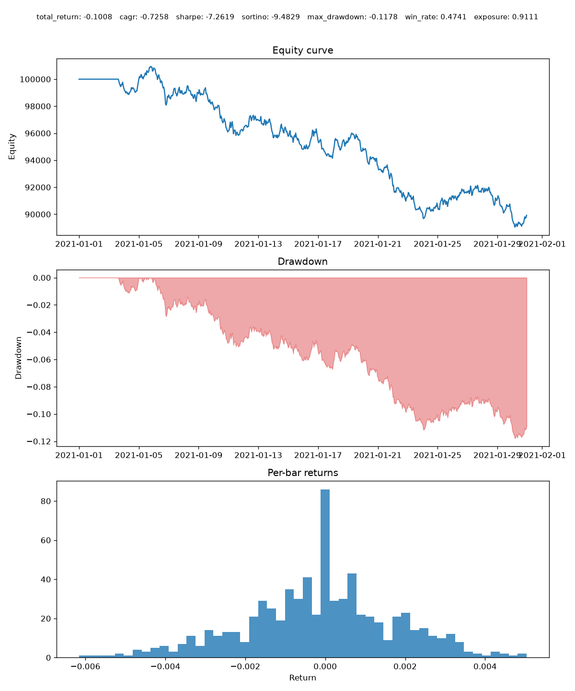

# backtester

An **event-driven** crypto backtesting engine in Python (BTC/USD demo). Built to
production standards as a portfolio piece: the same strategy code that runs a
backtest here is designed to run live later behind identical interfaces.

> **Status: runnable v1.** All four components — historic data handler,
> MA-crossover strategy, risk-based portfolio, simulated executor — and the
> performance/tear-sheet layer are implemented and tested end-to-end. See
> [`BACKTESTER_SPEC.md`](BACKTESTER_SPEC.md) for the full spec and the
> out-of-scope items deferred to later pieces.

## Why event-driven

A vectorised backtest and a live trading system are different programs, so a
vectorised backtest can lie. This engine pushes four events through one queue —

```
MarketEvent  ->  SignalEvent  ->  OrderEvent  ->  FillEvent
   (data)        (strategy)       (portfolio)     (execution)
```

— exactly as a live loop would. Swap the historic data handler for a live feed,
or the simulated executor for a real exchange client, and the strategy and
portfolio code do not change. That reusability is the whole point of the design.

## Architecture

```
                 ┌──────────────┐
   bars ───────► │ DataHandler  │  point-in-time; never leaks future bars
                 └──────┬───────┘
                        │ MarketEvent
                        ▼
                 ┌──────────────┐
                 │  Strategy    │  emits intent, no cash/risk knowledge
                 └──────┬───────┘
                        │ SignalEvent
                        ▼
                 ┌──────────────┐
                 │  Portfolio   │  risk-based sizing; tracks cash & equity
                 └──────┬───────┘
                        │ OrderEvent
                        ▼
                 ┌──────────────┐
                 │ Execution    │  commission + slippage; fills at t+1 open
                 └──────┬───────┘
                        │ FillEvent
                        ▼
                 ┌──────────────┐
                 │  Portfolio   │  applies fill; Performance builds tear sheet
                 └──────────────┘
```

`DataHandler`, `Strategy`, `Portfolio`, and `ExecutionHandler` are abstract base
classes; `BacktestEngine` owns only the loop and the queue and talks to each
purely through its interface (dependency injection).

## Quickstart

```bash
git clone https://github.com/Jhay-M/backtest-engine
cd backtest-engine
python -m venv .venv && source .venv/bin/activate
pip install -e ".[dev]"

python examples/ma_crossover.py   # run the demo backtest + write a tear sheet

pytest           # run the suite
ruff check .     # lint
black --check .  # format check
mypy             # type check
```

## Example

`examples/ma_crossover.py` runs the full event-driven engine on the committed
BTC/USD sample, prints the metrics, and writes a tear sheet:

```
$ python examples/ma_crossover.py

Backtest summary
--------------------------------
  total_return: -0.1008
          cagr: -0.7258
        sharpe: -7.2619
       sortino: -9.4829
  max_drawdown: -0.1178
      win_rate: +0.4741
      exposure: +0.9111
```



The demo strategy **loses** here — that is expected and honest: the committed
sample is a synthetic random walk (see [`data/README.md`](data/README.md)), and
a moving-average crossover has no edge on a random walk, so commission and
slippage grind equity down. It is a working demonstration of the *engine*, not a
profitable strategy. Point `--data` at real history to test a real hypothesis.

## Design notes

- **No lookahead bias.** A signal on bar `t` reads only bars `≤ t`; the order it
  raises fills at the **open of bar `t+1`**. `tests/test_no_lookahead.py` holds
  the proof of this invariant.
- **Costs are always modelled.** Every fill carries commission (bps) and
  slippage — a costless backtest is a red flag, so it is not representable here.
- **Point-in-time data.** The `DataHandler` contract forbids exposing any bar
  after the current timestamp.
- **Deterministic.** Runs are seeded (`config.seed`); identical inputs give
  identical outputs.
- **Crypto realism.** 24/7 market (annualisation uses calendar time, not trading
  days) and fractional position sizes.

## Layout

```
src/backtester/
  events.py       # MarketEvent / SignalEvent / OrderEvent / FillEvent
  data.py         # DataHandler ABC
  strategy.py     # Strategy ABC
  portfolio.py    # Portfolio ABC
  execution.py    # ExecutionHandler ABC
  performance.py  # metrics + tear sheet
  engine.py       # the event loop
  config.py       # pydantic-validated run config
tests/            # incl. test_no_lookahead.py
examples/         # runnable BTC/USD MA-crossover backtest
data/             # small committed BTC/USD sample
```

## License

MIT.
